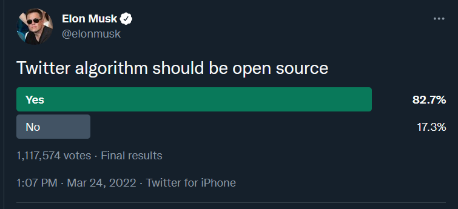
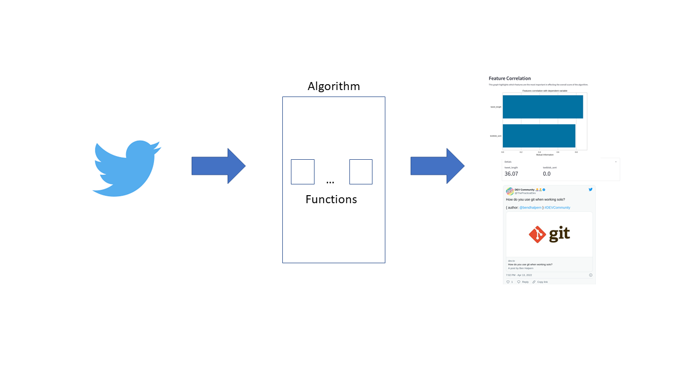
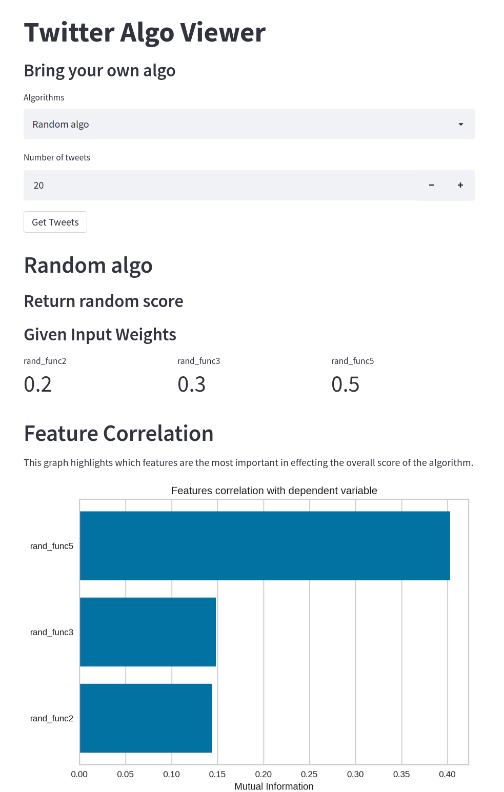
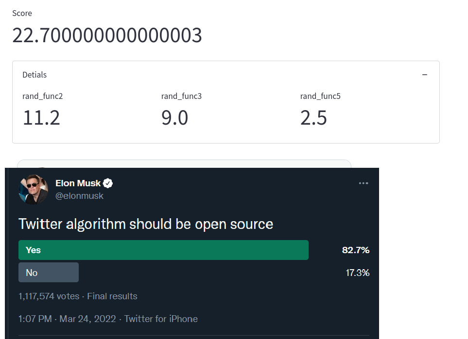

# Twitter Algorithm Builder

On March 24, 2022 Twitter ~~Board~~ Owner Elon Musk created a [poll](https://twitter.com/elonmusk/status/1507041396242407424) asking... "Twitter algorithm should be open source"



With an 82% of responses saying yes, this highlighted an unmet need in the public sphere. This repo provides an opinionated framework to build your own twitter algorithm, that you can use on your own timeline.

## How it works


The Twitter Algo builder leverages the get [home timeline](https://developer.twitter.com/en/docs/twitter-api/v1/tweets/timelines/api-reference/get-statuses-home_timeline) API endpoint to get a list of tweets for the user. Next the tweets are passed into your input algorithm which scores each tweet. The UI then provides a Feature Correlation graph that highlights which features are affecting the overall score of the algorithm, as well as the ranked tweets.

## Getting Started

The following will guide you on your way to create your own Twitter Algorithm

To start clone the repo via git and download dependencies

```
git clone https://github.com/banjtheman/twitter_algo_builder
pip install -r requirements.txt
```

### Twitter API

You will need the [Twitter v1.1](https://developer.twitter.com/en/docs/twitter-api/v1) API to build your algorithm against your home timeline.  
You can sign up here https://developer.twitter.com/en/docs/twitter-api

### Get Tweets

Once you have API access, you can get a list of tweets from your home timeline with the [/home_timeline](https://developer.twitter.com/en/docs/twitter-api/v1/tweets/timelines/api-reference/get-statuses-home_timeline) endpoint. The following code is how we get a list of tweets to be processed by your algorithm.

```python
from typing import Dict, Any, List
import twitter

CONSUMER_KEY = os.environ["CONSUMER_KEY"]
CONSUMER_SECRET = os.environ["CONSUMER_SECRET"]
ACCESS_TOKEN_KEY = os.environ["ACCESS_TOKEN_KEY"]
ACCESS_TOKEN_SECRET = os.environ["ACCESS_TOKEN_SECRET"]


def get_home_timeline(num_tweets: int = 20) -> List[Dict[str, Any]]:
    """
    Purpose:
        Get tweets from your timeline
    Args:
        num_tweets: number of twetts
    Returns:
        tweets from timeline
    """
    twitter_api = twitter.Api(
        consumer_key=CONSUMER_KEY,
        consumer_secret=CONSUMER_SECRET,
        access_token_key=ACCESS_TOKEN_KEY,
        access_token_secret=ACCESS_TOKEN_SECRET,
        tweet_mode="extended",
    )

    timeline_tweets = twitter_api.GetHomeTimeline(
        count=num_tweets, contributor_details=True
    )

    twitter_json_list = [] # Formatted List of tweets

    for tweet in timeline_tweets:

        username = tweet.user.screen_name  # Username vlaue
        id_str = tweet.id_str  # id str

        curr_tweet = tweet._json  # JSON object

        # Get the twitter url
        curr_tweet["twitter_url"] = f"https://twitter.com/{username}/status/{id_str}"

        # Add the json to list
        twitter_json_list.append(curr_tweet)

    return twitter_json_list
```

### Creating an algorithm

An algorithm scores each tweet, and the higher the tweet is, the higher it shows on your timeline. Currently Twitter's algorithm is a ["black box"](https://en.wikipedia.org/wiki/Black-box_testing) as we don’t know what is on the inside and can only make guesses on how it works. This repo provides a mechanism to create your own algorithm so you could view your timeline based on what you deem as important.

This framework for the algorithm is based on [Functions](algo_builder/function.py) which are self-defined process that score a tweet from -100 to 100. The higher score, the higher the tweet appears on the timeline. Example functions include sentiment, tweet length, number of followers, and other attributes. Each of these functions is then weighted to create a [`Weighted Function`](algo_builder/weighted_function.py). This allows for certain features to be more important. For example perhaps I want sentiment to be 3x more important that number of followers in determined what is shown in my feed first.

A collection of `Weighted Functions` creates an `Algorithm` which will sum the score of all the functions based on the tweet's data.

#### Functions

The `Function` class requires a Name, description and the code to run. The code should take in one parameter which is the tweet data for an individual tweet. The code must return a number between -100 and 100 or a ValueError will be thrown. Here is an example Function of code that just returns a random number.

```python
import random


def rand_func(tweet):
    """
    Purpose:
        Return a random number between -100 and 100
    Args:
        N/A
    Returns:
        random number
    """

    return random.randint(-100, 100)

# Make a random function
rand_func_action = Function(
    "Random Function", "Returns a random value", rand_func
)
```

#### Weighted Functions

The `Weighted Function` class requires a Weight, Function and a Name. The Weight is a float that will be multiplied to the score the function returns.
Here is an example of three Weighted Functions using the `rand_func` Function from above.

```python

# Make three different weighted random functions
weighted_func2 = WeightedFunction(0.2, rand_func_action, "rand_func2")
weighted_func3 = WeightedFunction(0.3, rand_func_action, "rand_func3")
weighted_func5 = WeightedFunction(0.5, rand_func_action, "rand_func5")
```

#### Algorithms

The `Algorithm` class requires a Name, Description and a list of `Weighted Functions`.  
Here is an example of our Random Algorithm using the 3 `Weighted Functions` from above.

```python
# Create Random algo using all three functions
rand_algo = Algorithm(
    "Random algo",
    "Return random score",
    [weighted_func2, weighted_func3, weighted_func5],
)
```

##### Saving Algorithms

To make your Algorithm reusable, you can save the output using the `save_algo` function in [algorithm.py](https://github.com/banjtheman/twitter_algo_builder/blob/main/algo_builder/algorithm.py#L50-L72)

```python
from algo_builder.algorithm import Algorithm

print("Saving algorithm")

rand_algo = Algorithm(
    "Random algo",
    "Return random score",
    [weighted_func2, weighted_func3, weighted_func5],
)

rand_algo.save_algo(folder="saved_algos")
```

This will produce two artifacts in the passed in folder.

- ALGONAME.algo - This is the pickled class of the Algorithm
- ALGONAME.json - This is a JSON file with the Algorithm metadata

##### Loading Algorithms

To load your Algorithm, simply use the `load_algo` function in [algorithm.py](https://github.com/banjtheman/twitter_algo_builder/blob/main/algo_builder/algorithm.py#L117-L132)

on a .algo file.

```python
from algo_builder.algorithm import Algorithm

# Load algo
loaded_algo = Algorithm.load_algo('saved_algos/Random algo.algo')
print(f"Loaded algo {loaded_algo.name}")

print("Done and Done")
```

#### Running the Algorithm

The `process_tweets` function in [algorithm.py](https://github.com/banjtheman/twitter_algo_builder/blob/main/algo_builder/algorithm.py#L75-L113) takes in a list of tweets to return a sorted pandas dataframe with each of the weighted functions score and the overall algorithm's score.

```python
print("Running algorithm on Tweets")

# Load Tweets
timeline_tweets = get_home_timeline()

# Define Algo
rand_algo = algos.SimpleAlgo.define_algo()
rand_algo.save_algo()

# Run algo on tweets
df = rand_algo.process_tweets(timeline_tweets)

print(df)
print("Done and Done")
```

Here is an example csv

```
rand_func2,rand_func3,rand_func5,algo_score,twitter_url
17.6,6.0,36.0,59.6,...
6.4,14.399999999999999,10.5,31.299999999999997,...
-13.200000000000001,18.9,15.5,21.199999999999996,...
-8.200000000000001,6.0,14.0,11.799999999999999,...
-16.2,-10.2,38.0,11.600000000000001,...
```

To run an end to end example you can run the [test_algo_builder.py](https://github.com/banjtheman/twitter_algo_builder/blob/main/test_algo_builder.py) script.

```bash
export CONSUMER_KEY=INSERT_YOUR_VALUE
export CONSUMER_SECRET=INSERT_YOUR_VALUE
export ACCESS_TOKEN_KEY=INSERT_YOUR_VALUE
export ACCESS_TOKEN_SECRET=INSERT_YOUR_VALUE
python test_algo_builder.py
```

### View your timeline with Streamlit

Using [Streamlit](https://streamlit.io/) the [algo_viewer_st.py](https://github.com/banjtheman/twitter_algo_builder/blob/main/algo_viewer_st.py) script provides a User interface that allows us to visualize how our timeline would be using the saved algorithms.



The metrics for each tweet can be viewed, to let you know why it appeared higher in your timeline.



To start run the following, then view `http://localhost:8501/` in your browser.

```bash
export CONSUMER_KEY=INSERT_YOUR_VALUE
export CONSUMER_SECRET=INSERT_YOUR_VALUE
export ACCESS_TOKEN_KEY=INSERT_YOUR_VALUE
export ACCESS_TOKEN_SECRET=INSERT_YOUR_VALUE
streamlit run algo_viewer_st.py
```

### Example Algorithms

Here are some example algorithms

### Positive + Tweet Length

This [Simple Algorithm](https://github.com/banjtheman/twitter_algo_builder/blob/main/algos/simple_algo.py) scores tweets based on how positive the text is and how many characters are being used.
